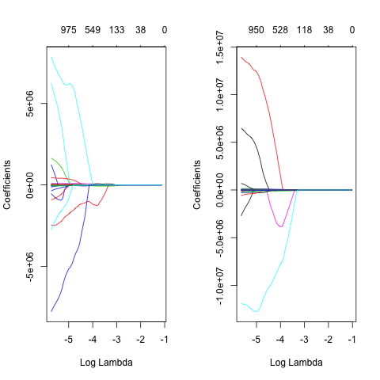

```{r setup, include=FALSE}
knitr::opts_chunk$set(echo = FALSE, cache = T, cache.path = "cache/", fig.path = "fig/", warning = F, message = F, fig.align = "center")

#Loading the packages
suppressMessages(library("tidyverse"))
library(caret)
library(glmnet)
library(psych)
library(scatterplot3d)
```

```{r setup2}
#Loading the data
load("data/fMRIdata.RData")

#Sourcing functions using R
source("code/load_clean_data.R")

source("code/utils.R")

#source("code/lasso.R")

```

#Introduction
A challenging goal in neuroscience is to  be able to read out or decode mental content from brain activity. For this project, we use the decoding method based on quantitative receptive-field models that characterize the relationship between visual stimuli and fMRI activity in early visual areas [@kay2008identifying]. Using these models we can describe the tuning of individual voxels for space, orientation and spacial frequency, and the models could be estimated directly from the responses evoked by natural images. These receptive-field models make it possible to identify, from a large set of completely novel natural images, which specific image was seen by the observer. Identification is not a mere consequence of retinotopic organization of visual areas; simpler receptive-field models that describe only spatial tuning yield much poorer identification performance. According to the results shown by Kay et al. in their paper [-@kay2008identifying], it may soon be possible to reconstruct a picture  of a person's visual experience from measurements of brain activivty alone. 

This project is broadly divided into two parts. The first is to develop a model that predicts the voxel response to new images. Here we consider several models that could be employed to do the prediction and based on theoretical and performance measures of the models select the best one to actually predict the brain responses in 20 voxels for those images. The second part deals with interpreting the prediction models in relation into the scientific problem - how do voxels respond to images. This report would begin with briefing the experiment, to understand the terms used and the context which would in turn rigorously prepare us to transition in the designing and interpreting the prediction model to decode the human brain's response to images.


#Experiment and Terminologies
V1 is the brain area that reacts when people see things.The visual cortex of the brain is a part of the cerebral cortex that processes visual information. It is located in the occipital lobe.Visual nerves run straight from the eye to the primary visual cortex to the Visual Association cortex.

The fMRI data is from the Gallant Neuroscience Lab at University of California, Berkeley. In this experiment, a subject is shown a series of randomly selected natural images and the fMRI response from his primary visual cortex is recorded. The fMRI response is recorded at the voxel level, where each voxel corresponds to a tiny volume of the visual cortex. The task is to model each voxel’s response to the images. The image features are approximately 10000 transformed Gabor wavelet coefficients. We evaluate the prediction performance by looking at correlation scores against an untouched validation set of 537 images. There are 1250 voxels in all. Ranking them according to their predictive performance under a different procedure (Kay et al. 2008), not all of them are informative, so we only look at the top 20.


#Predictive Model Design
We would use linear models for prediction. A linear regresion model assumes that the regression function $E(Y|X)$ is linear in the inputs $X_1,...,X_p$. The linear model has been the mainstay of statistics for past 30 years. Although developed in the pre-computer era, their simplicity and interpretability makes their use indespensible in today's time too. For prediction purposes they can outperform fancier non linear models, especially in situations with small number of training cases, low signal to noise ratio and sparse data. Finally, linear methods can be applied to transformations of the inputs as in our case and this justifies our choice of linear models for prediction.

The complexity of linear functions of many variables grow exponentially with the dimension, and if we wish to estimate them with same accuracy as in lower dimensions, then we need the size of training set to grow exponentially as well [@friedman2001elements]. The total data size we have is much smaller than the dimensions or the number of features we have i.e. $p>>n$. Since we cannot do predictions with all the features in the regression model, we would either need a shrinkage method or subset selection for regression. In this report, we develop two models one with the shrinkage method (LASSO) and a subset selection method (Forward and Backward -Stepwise selection). 

##Pre-Processing

Our model needs to predict the response for 20 voxels in the brain. To apply selection and shrinkage methods in the multiple output case, we could either apply a univariate technique individually to each outcome or simultaneously to all outcomes. The former strategy would allow different amounts of regularization to be applied to different outcomes but require estimation of $20$ seperate regularization parameters $\lambda_1,...,\lambda_{20}$, while the latter would permit all k outputs to be used in estimating the sole regularization parameter $\lambda$.

To decide between the two cases, we see the relationships between the voxel responses in figure \ref{fig:corrplot} and found them to be not very strong. None of them are greater than 8 and to be meticulous in the prediction, we compute a different model for each of the 20 voxels.

```{r corrplot, fig.cap="Correlation between the responses of the 20 voxels to 1750 images", out.width = '100%'}
#Correlations between the vortex responses
corr_plot <- corrplot::corrplot(cor(resp_dat), method = "shade", addCoef.col = T, addgrid.col = c(7), addCoefasPercent = T, number.cex = 0.7)
#pairs.panels(resp_dat, cex.cor = 7, stars = TRUE, ci = T, digits = 2)

```

##LASSO
The LASSO estimate is defined by $$\hat\beta^{LASSO} = argmin_{\beta}{\frac{1}{2} \sum_{i = 1}^N({y_i -\beta_0 -\sum_{j = 1}^p{x_{ij}\beta_{j}}})^2} + \lambda \sum_{j=1}^{p}|\beta_j|$$The later $L_{1}$ penalty makes the solution for lasso non linearin the $y_{i}$. Because of teh nature of the constraint, increasing the $\lambda$ will cause some of the co-efficients to be exactly zero. Thus the LASSO is kind of continuous subset selection.
###LASSO Model Selection Criteria
There are quite a many model selection criteria prevalant and used to select the models in the regression. Some of the most common ones are : $CV$(Cross Validation), $ESCV$(Estimation Stability with Cross Validation), $AIC$(Akaike Information Criteria), $AIC_c$(AIC with correction for small sample sizes) and $BIC$(Bayesian Information Criteria). 

Though AIC and BIC are both Maximum Likelihood estimate driven and penalize free parameters in an effort to combat overfitting, they do so in ways that result in significantly different behavior.

$$AIC = -2ln(Likelihood) + 2k$$
and

$$BIC = -2ln(Likelihood) + ln(N)k$$
where $k$ is the model degrees of freedom and $N$ is the number of observations. AICc is the small-sample-size corrected version of Akaike information criterion (AIC) to measure goodness of fit for a large sized model. $$AIC_c = AIC + \frac{2k^2 + 2k}{n-k-1}$$ The best model in the group compared is the one that minimizes these scores, in both cases. Clearly, AIC does not depend directly on sample size. Moreover, generally speaking, AIC presents the danger that it might overfit, whereas BIC presents the danger that it might underfit, simply in virtue of how they penalize free parameters ($2k$ in $AIC$; $ln(N)k$ in $BIC$). Diachronically, as data is introduced and the scores are recalculated, at relatively low N BIC is more tolerant of free parameters than AIC, but less tolerant at higher N (as the natural log of N overcomes 2).

Additionally, AIC is aimed at finding the best approximating model to the unknown data generating process (via minimizing expected estimated K-L divergence). As such, it fails to converge in probability to the true model (assuming one is present in the group evaluated), whereas BIC does converge as N tends to infinity.

By estimating the performance of the models with each of the above information criteria, we find that ESCV criterion compares favorably with CV and BIC where they are known to excel figure \ref{fig:corr_comp}, and outperforms them in other scenarios over different performance criteria. In particular, ESCV obtains excellent model selection results that are substantially better than those from CV which is testified in figure \ref{fig:lambda_comp}. When the predictors are correlated, which is true in our case (image pixels are highly correlated to each other), ESCV also often outperforms CV for parameter estimation while at same time provides prediction errors comparable to those of CV.


```{r corr_comp, fig.cap="Comparision of selection criteria of LASSO models for 20 Voxels based on Correlation Score", out.width = '100%'}

```

```{r lambda_comp, fig.cap="Comparision of selection criteria of LASSO models for 20 Voxels based on Penaly Parameter", out.width = '100%'}

```

##Regression
Ridge regression shrinks the regression coefficients by imposing an $L_2$ penalty on their size.
$$\hat\beta^{ridge} = argmin_{\beta}{{\frac{1}{2} \sum_{i = 1}^N({y_i -\beta_0 -\sum_{j = 1}^p{x_{ij}\beta_{j}}})^2} + \lambda \sum_{j=1}^{p}\beta_j^2}$$ When there are many correlated variables in linear regression model, ridge regression alleviates the large positive and negative coefficients of the correlated variables.

Elastic net regression is the mixture of Ridge and LASSO regression. It penalizes the coefficient as a linear combination of $L_1$ and $L_2$ penalty. The elastic net estimate is thus given by
$$\hat\beta^{Elastic Net} = argmin_{\beta}{\frac{1}{2} \sum_{i = 1}^N({y_i -\beta_0 -\sum_{j = 1}^p{x_{ij}\beta_{j}}})^2} + \alpha(\lambda \sum_{j=1}^{p}|\beta_j|) + (1-\alpha)(\lambda \sum_{j=1}^{p}\beta_j^2)$$

```{r regMod_comp, fig.cap="Performance Comparision of Elastic Net, LASSO and Ridge Regression with Cross Validation as the model selection criteria for all on the validation set", out.width = '100%'}

```
##The best Prection Model
Figure \ref{fig:corr_comp} convinces us that the cross validation on an average gives the best performance amongst all the model selection criterias namely AIC, BIC, AICc, CV and ESCV on LASSO. We extend this reasoning to all other models and thus in order to decide the best model, we compare the performance of Ridge, LASSO and Elastic Net models selected by cross validation on the validation set. The performance parameter remains the same, i.e. correlation score. 

We fit all the three models namely ridge, elastic net and LASSO to our data using 10 folds cross validation model selection criteria to compare the performance of each. As can be seen from the figure \ref{fig:regMod_comp}, the performance of elastic net model is clearly the foremost for almost all the voxel's prediction. LASSO model although not the best but is quite similar to the performance of elastic net and looses by a very slight difference. The ridge regression model slacks significantly from the best prediction. Therefore, to predict the brain respons in voxel 1 we would use the Elastic Net Model. 


##Model Diagnostics
We try to investigate the similarity between the features shared by various models. For the purpose of simplicity, we choose to do this detailed analysis on models for voxel number 7 and 9. The reason for selecting these voxels is three folds. First, the prediction accuracy of our final model is the best for voxel 9 which is followed by voxel 7 (figure \ref{fig:regMod_comp}). Secondly, the responses of voxel 7 and 9 are the most correlated to each other (correlation is 0.8) as shown by the corrogram in the figure \ref{fig:corrplot}. Also these voxels are highly correlated with a lot of other voxels like voxel 2, 3, 4, 14, 15, 17, 18, 19 etc. Studying their behaviour could help us understand the responses, properties and characteristics of a gamut of voxels in the brain. Lastly, we take into account the relative location of the voxels in the brain and if there is any structural grouping due to locations. Applying k-means clustering algorithm, we find that there is a sharp elbow for number of clusters as 3. Visulaizing the voxels according to their position in the brain with clustering, we observe that in figure \ref{fig:cluster}, voxels 7 and 9 are right in the center position surrounded by other voxels all around. Through our domain knowledge on human brain, these positions tend to be more crucial and pertinent to responding to the images than the ones in the periphery. While voxels 7 and 9 donot share the same cluster which opens the scope of observing variance in their activity, they are not too far apart as well. Therefore, we select these voxels for further analysis.

```{r cluster, fig.cap="Elbow curve to select the number of clusters (left) and the spatial arrangement of voxels in brain coloured by the three clusters (right)"}
#Plotting location of the Voxels in the brain
library(scatterplot3d)

#Preparing data for elbow curve for kmeans
data_matrix <- as.matrix(loc_dat)
set.seed(7)
#gc()
wss <- (nrow(data_matrix)-1)*sum(apply(data_matrix,2,var))
for (i in 2:10) wss[i] <- sum(kmeans(data_matrix,
                                     centers=i, iter.max=1000, nstart = 25)$withinss)

#Plotting the elbow curve (run the code below to plot the elbow curve)
#elbow_plot <- plot(1:10, wss, type="b", xlab="Number of Clusters",
#     ylab="Within groups sum of squares", col = "blue", lwd = 3) + abline(v # = 3, lty=3, col = "yellow", lwd = 3)

#Trying to visualize kmeans clusters in 3d and see if that makes any sense \
set.seed(7)
data_matrix <- as.matrix(loc_dat)
grouping_vortex <- kmeans(data_matrix, centers = 3, iter.max = 10000, nstart = 25)
#grouping_vortex$cluster
loc_dat <- as.data.frame(loc_dat)
loc_dat$cluster <- grouping_vortex$cluster
loc_dat$vortex_label <- c(1:20)
colors <- c("#999999", "#E69F00", "#56B4E9")
colors <- colors[as.numeric(loc_dat$cluster)]


#Replace the directory and file information with your info
library(png)
ima <- readPNG("extra/brain.png")

s3d <- scatterplot3d(loc_dat[, 1:3], color = colors, pch = 21, bg = "red", angle = 45, lty.grid = 0, lty.axis = 0, cex.symbols = 3.5, xlab = "X dimension", ylab = "Y dimension", zlab = "Z dimension") 
text(x = as.numeric(s3d$xyz.convert(loc_dat[, 1:3])$x), y = as.numeric(s3d$xyz.convert(loc_dat[, 1:3])$y), labels = as.character(rownames(loc_dat)), cex= 1.4, col = "black", lwd = 7)
#Get the plot information so the image will fill the plot box, and draw it
lim <- par()
rasterImage(ima, lim$usr[1], lim$usr[3], lim$usr[2], lim$usr[4])
points(x = as.numeric(s3d$xyz.convert(loc_dat[, 1:3])$x), y = as.numeric(s3d$xyz.convert(loc_dat[, 1:3])$y), cex = 3.5, col = colors, pch = 9, lwd = 7)
text(x = as.numeric(s3d$xyz.convert(loc_dat[, 1:3])$x), y = as.numeric(s3d$xyz.convert(loc_dat[, 1:3])$y), labels = as.character(rownames(loc_dat)), cex= 1.4, col = "black", lwd = 7, bg = "black", bty = "7")

```
Now, for these two voxels, we study the two models : LASSO with model selection criteria as ESCV and LASSO with model selection criteria as only CV. This will help us find the behaviour of two best predictions along with comparing the subtle differences in the model performances of each. We start with voxel 7. We define the prediction error to be the vector whose each element is the absolute value of the differene between the prediction response and the actual response from the respective image. $$Prediction Error_{model, voxel} = |Prediction_{model, voxel} - Actual Response_{voxel}|$$. 


### Analysis of Outliers
We observe that the CV model's prediction accuracy is only slightly better (~1%) than the ESCV model which is not easily decipherable in the figure\ref{fig:outlier} that shows the distribution of the prediction errors of voxel 7 and 9 for the two models. The ourliers they have are pretty common which points to the similarity of these models. Overall, the predictions are quite accurate with not more than 6-7 images that have wrong prediction with errors more than 2. Except these outliers the errors are all less than 1. The outliers could be noise in the data or error in the measurement of teh response by the mind or it is possible that these images have some association in the person's mind which makes the response different than the model predicts. We should include more images of these kinds in our training model in the future to be able to confirm which of the above two scenario is at play in our case.

```{r outlier, fig.cap="Outlier's analysis for the ESCV and CV models fro Voxel 7 and Voxel 9", out.width = '100%'}
#Please find the code for the plot in the file Lasso.R

```

### Feature Importance
Since the ESCV fits a really parsimonious mode, we try to see if the features it selects are shared across the models and important predictors for the voxels. When we plot the value of coefficients as a function of lambda, we observe that only a couple of feature remain non zero as lambda gets larger. The ones that do, are the most important features for predicting the voxel response. When we fit the models through cross validation criteria and study their behaviour with lambda, we observe that although the best features for different voxels are not the same, but we do find some prominent features like $10877^{th}$  and $9393^{rd}$ feature which stay non zero for long with larger values of $\lambda$ for many voxel models like voxel 6, 7, 8 and 9. The purpose of clarity and space constarint restrict us to produce the relationship of feature coefficients for the model of voxel 7 and voxel 6 only in this report (\ref{fig:fs}) without labels. In the next section, we would find out whether these features are stable across bootstrap samples for a given model.
 
```{r fs, fig.cap="Relationship between lambda and Co-efficients of Models for two voxels sharing some top features"}

```


### Stability Analysis (Bootstrapping and Hypothesis testing)
After getting a good prediction performance, we need to check whether the model and it's predictions are stable across different training samples or jumpy. A jumby model would suggest that with slight variations in the data, our model would fail to perform well and thus cannot be used for predictions. The training data we used for the first time for reasons like insufficient data, sample bias etc might not be representative of the complete population and thus, our model might not be the best one. To ensure the stability of the model as well as it's prediction, we bootstrap 500 samples from the data and refit the model using the bootstraps. We obtain a distribution of the coefficients on these bootstrap. This technique called 'Bootstrapping Pairs' would thus give the range or confidence interval for the estimates. 

Other method to do bootstrap is through residuals, where we fit the model to obtain $\hat{y}$. The errors obtained by sustracting the estimated response variable and the true response variable are then sampled and added to the estimated response variable. This new response variable is used to fit the model again, which gives us different coefficient for each distinct error sample added to the response variable. This method is called 'Bootstrapping Regression Residuals'. Bootstrapping pairs require fewer assumptions about the data. It only assumes $(x_{i}, y_{i})$ are iid from a distribution $F$. But it can be dangerous for categorical predictors or skewed distributions. Residuals are better when the model is reasonably specified (because the data $X$ remains unchanged).
The distribution of estimates that we get from the bootstrapping could be used to do hypothesis testing. We could get the probability of occurance of a particular estimate which could help give confidence in the model we use. The null hypothesis could also be set as $\hat{\beta} = 0$ which could be rejected only if the probability of $\hat{\beta} = 0$ under the distribution of the estimate obtained from bootstarpping is less than the significance level which is generally set as $\alpha = 0.05$ or $\alpha = 0.01$ (to be more stringent).  

Since bootstrapping is computationally expensive, we restricted our analysis to only the two models ESCV and CV for voxel 9. The regression co-efficients that we obtain with ESCV model selection criteria in LASSO are very similar to the ones obtained on bootstrapping. Their lower and upper interval levels are also narrower compared to the wider confidence intervals obtained for the co-efficients obtained for other model selection criterias. Most importantly, we find that the features selected by both the models in the bootstraps were the same. This ensures the stability of our model as far as feature selection is concerened.


#Scientific Interpretation of Voxel Response to Images

The prediction of brain response to the new images was one part of the research. The second more important part is to decode how the voxels respond to the images. Is there any pattern associated and if so, we must set some ground work for estimating the image from a particular voxel response. To realize that line of thought, we try to observe the images that correspond to the extreme responses very high and very low in the two voxels 7 and 9.

We divide the images into three categories : first the one that invoke a high positive response in the two voxels, second the images that tend to have average response (close to zero magnitude) and the ones that invoke a very low response (high magnitude negative). Observing the images that summon high negative response, we find that those images are the same for voxel 7 and 9. These images shown in figure \ref{fig:neg_9} are the kind that symbolize nature, serenity, silence and peaceful feelings. Therefore, for this particular person, nature like lakes, leaf, mountain, ice etc tend to calm him down and reduce the activity in these voxels of his brain.

```{r neg_9, fig.cap="Images that evoke the least (or the most negative) response in Voxel 9"}

#Plotting images corresponding to the least response in the voxel
neg_9 <- list()
par(mfrow=c(2,2), mar = c(2,2,2,2), oma=c(1,1,1,1))
for(i in which(-resp_dat[ , 9] > 3.2)){
  neg_9[[as.character(i)]] <- ReadImage(i)
  image(neg_9[[as.character(i)]], col = gray((0:500) / 501))
}


#Check that the images that invoke high negative valued response from voxel 7 are the same as the ones for voxel 9

#isTRUE(which(-resp_dat[ , 9] > 3.2) == which(-resp_dat[ , 7] > 3))

```


```{r pos_9, fig.cap="Images corresponding to the highest positive response in Voxel 9"}

#Plotting the images corresponding to the highest positive response in the voxel 9
pos_9 <- list()
par(mfrow=c(2,2), mar = c(2,2,2,2), oma=c(1,1,1,1))
for(i in which(resp_dat[ , 9] > 2.5)){
  pos_9[[as.character(i)]] <- ReadImage(i)
  image(pos_9[[as.character(i)]], col = gray((0:500) / 501))
}
```


```{r zero_9, fig.show=F, fig.keep=F, fig.cap="Images in voxel 9 that cause average response (around 0) in Voxel 7"}

#Run this code to see the images that produce zero response
#zero_9 <- list()
#par(mfrow=c(2,2))
#for(i in which(abs(resp_dat[ , 9]) < 0.0036)){
#  zero_9[[as.character(i)]] <- ReadImage(i)
#  image(zero_9[[as.character(i)]], col = gray((0:500) / 501))
#}
```

When we try to study the images  shown in figure \ref{fig:pos_9} that invoke high positive response, we see that these are the images that associated with energetic animals like dear and wolf, animals that most closely resemble to humans i.e. chimpanzee, statue of a person, a person doing work and a picninc spot. Although there is slight difference between the images results in the highest response in voxel 7 and 9, they are tied with a common thread of images that tend to be associated with energy, human instincts of survival and emotions.

The images that are somewhere in the middle, figure lean to be the ones that are a bit ambiguous in their apprearance, i.e. it is not very clear what they represent form the picture. It seems like even if the person deciphers the image, they are not the ones with strong human emotion associated nor are they very calming as the ones with the lowest response.

#Conclusion

Our model can predict the voxel response to images and get an average correlation of 0.4 to the actual voxel response. The ESCV model is comparable to CV model in terms of prediction accuracy but outperforms CV in terms of other performance measures like model size and stability when bootstrapped. Along with prediction of response, we were able to find the features most stable and prominent across different models and bootstrapped samples. Lastly, we tried to predict the image from the voxel response by segmenting the images based on the responses known.

# References 